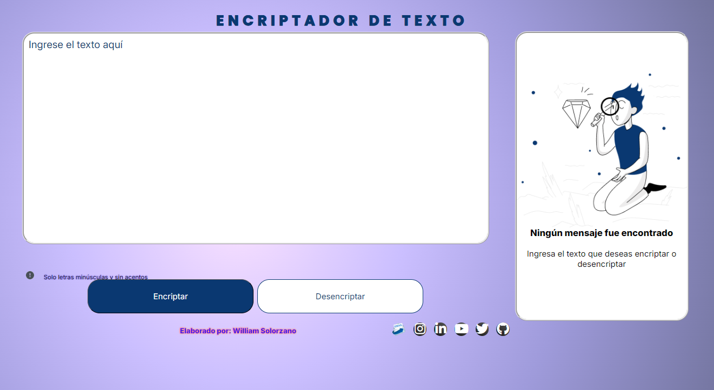

# Text Encriptor

For this project we are building a  text encriptor similar to this one:

[Encriptor Text](https://wrogerss.github.io/Challenger_Encriptador/)

I've used a Programming tools like:

- HTML
- CSS
- Javascript

The idea of the program is to have the next capabilities:

- [x] Encrypt text with a code to replace vowels.
- [ ] The text must be in lower case and without accents.
- [ ] Previous text can be decrypted
- [ ] The encrypted text is copied to the clipboard for ease of management

### Diagram
This is the interface of the encryptor and its functionalities

